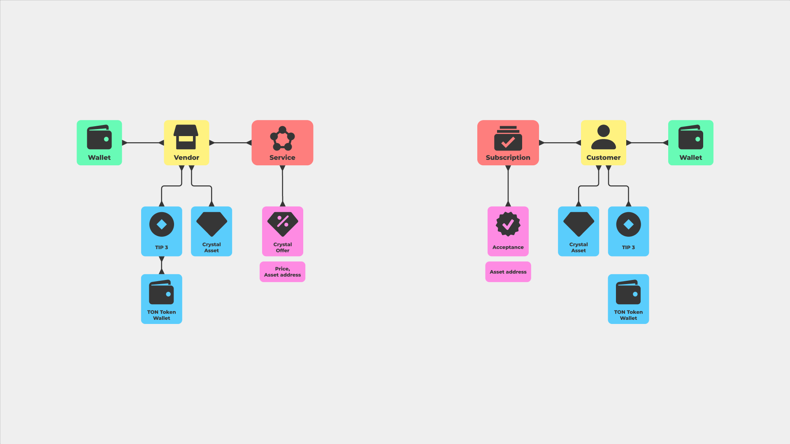

# Subscription sustem


## Requirements

* [Node.js](https://nodejs.org) >= `16.x`
* [Yarn](https://classic.yarnpkg.com) >= `1.22.x`
* [Free TON Development Environment](https://github.com/tonlabs/tondev) >= `0.7.x`


## Installation
```sh
yarn install && yarn cp
```
Check and edit `configs/config.ts`


## Compilation
```sh
yarn make
```


## Local node startup
```sh
yarn up
```


## Tests
### Locally
```sh
yarn test
```

### In public network
```sh
yarn cross-env net=<network> yarn test
```
* `network` - network name from `configs/config.ts`

**Examples**
```sh
yarn cross-env net=local yarn test
yarn cross-env net=dev yarn test
yarn cross-env net=main yarn test
yarn cross-env net=fld yarn test
```


## Code style
[Link](docs/CODE_STYLE.md)


## Not completed
Yes. This shit is not completed. No debots or payment system. I just want show architecture and the idea.
I set out to make an extensible architecture. So that you can pay for a subscription not only with crystals, but also with NTF tokens, as well as implement any subscription logic, for example, with a discount or to two addresses at once. A also spend a lot of time for testing tools `jton` and presentation. Because of this, I simply did not have time to finish everything.